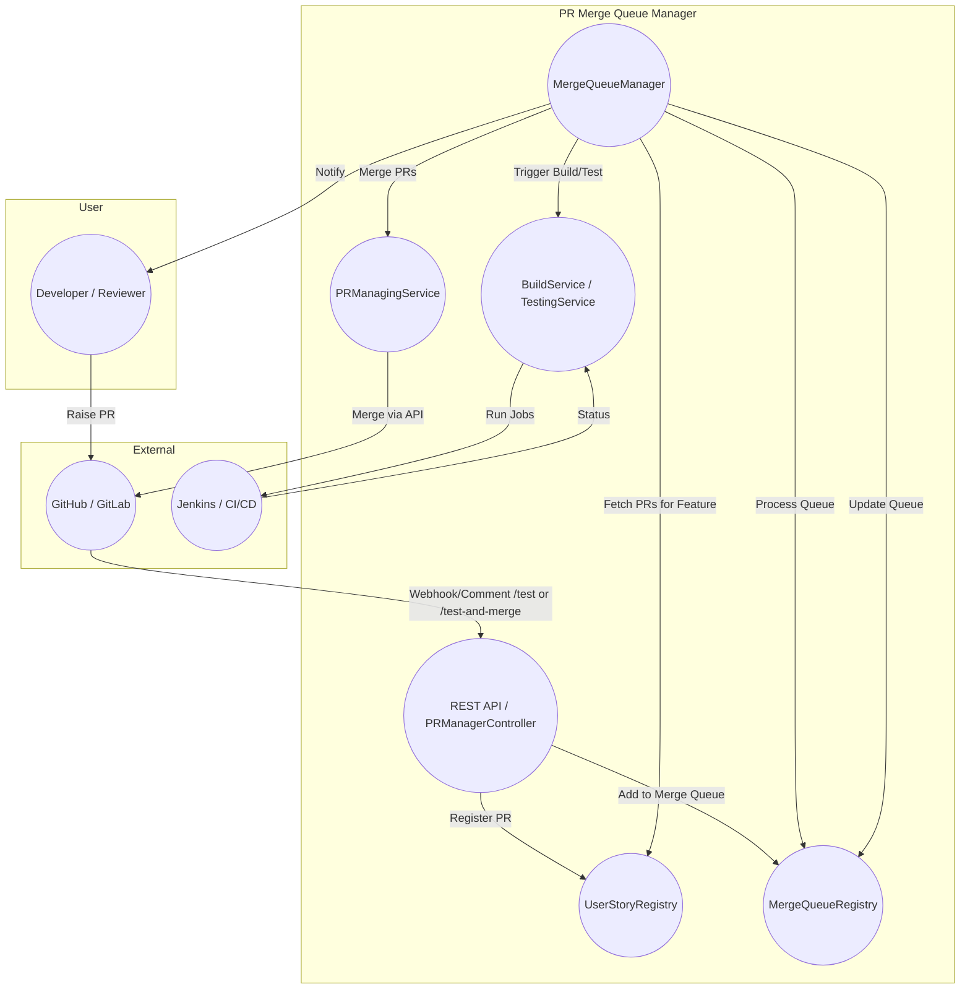

# PR Merge Queue Manager (PRM)

## Overview

PRM is a Spring Boot-based tool designed to manage and automate the merging of multiple Pull Requests (PRs) that are part of a single feature in a microservice architecture.
It ensures that PRs with dependencies are grouped, tested, and merged in a controlled, pluggable, and extensible way.

---

## Features

- **Feature-based PR Grouping:** Automatically groups PRs under a feature (based on branch naming convention).
- **Automated Testing & Merging:** Supports commands like `/test` and `/test-and-merge` via PR comments to trigger automated test and merge flows.
- **Merge Queue:** Manages a queue of PR sets to be merged, ensuring only one set is processed at a time.
- **Async Processing:** Uses asynchronous background processing for merging and updating PRs.
- **Pluggable Services:** Build, test, and PR management services are interface-driven and easily replaceable.
- **Extensible Workflow:** Add custom steps to the merge pipeline.
- **Configurable:** All major functionalities can be enabled/disabled and customized.

---

## Architecture & Main Components


### Architecture Diagram

Below is a high-level architecture and flow diagram for the PRM system, using Mermaid syntax. You can render this diagram using Mermaid live editors, VS Code plugins, or GitHub's built-in Mermaid support.



**Legend:**
- **User:** Developer or Reviewer interacting with PRs.
- **External:** External systems like GitHub/GitLab and Jenkins/CI/CD.
- **PRM:** Main components of the PR Merge Queue Manager.

---

You can convert this Mermaid diagram to an image using online tools (e.g., https://mermaid.live/) or VS Code extensions for documentation or presentations.


### 1. Application Entry Point
- **PrmApplication.java:** Bootstraps the Spring Boot application, enables async and scheduling.

### 2. Controllers
- **PRManagerController.java:** Exposes REST endpoints for registering, removing, and managing PRs under user stories/features.

### 3. Async Processing
- **MergeQueueManager.java:** Handles the background processing of the merge queue, coordinates merging, and interacts with registries.

### 4. Interfaces & Services
- **interfaces/**: Contains interfaces for build, test, PR management, and registry services.
- **services/**: Implementations for GitHub PR management, Jenkins build/testing, etc.

### 5. Registries
- **registry/**: Manages the state of merge queues and user stories/features.

### 6. Models
- **model/**: Data models for PRs, comments, and requests.

### 7. Configuration
- **config/**: Async executor and health check configuration.

---

## How It Works

1. **PR Registration:**
   - When a PR is raised, it is registered with PRM under a feature (feature name = branch's first word).
2. **Triggering Actions:**
   - Reviewer/author comments `/test` or `/test-and-merge` on the PR.
   - `/test` triggers automated tests for the feature.
   - `/test-and-merge` adds the PR set to the merge queue.
3. **Queue Processing:**
   - PRM picks the next set from the queue, runs checks, triggers regression, and merges all PRs in the set.
   - Waits for build/deployment before proceeding to the next set.
4. **Async Updates:**
   - While merging, an async process updates the rest of the queue.

---

## How to Run

1. **Build the Project:**
   ```sh
   mvn clean install
   ```
2. **Run the Application:**
   ```sh
   mvn spring-boot:run
   ```
   Or run the generated JAR from the `target/` directory:
   ```sh
   java -jar target/prm-*.jar
   ```
3. **Configuration:**
   - Edit `src/main/resources/application.properties` as needed for your environment.

---

## How to Test

- To test, use the provided PowerShell script:
  ```sh
  ./simulate-pr-flow.ps1
  ```
  If you are getting error about permissions to run this script, run the following command to temporarily allow script execution:
  ```sh
  Set-ExecutionPolicy -Scope Process -ExecutionPolicy Bypass
  ```
  This script simulates PR registration, testing, and merging flows against the running application.

- You can also use tools like Postman or curl to interact with the REST endpoints (e.g., `/pr/register`).

- **Unit Tests:**
  ```sh
  mvn test
  ```

---

## Class Responsibilities

- **PrmApplication:** Main entry point, configure async and scheduling.
- **PRManagerController:** REST API for PR and user story management.
- **MergeQueueManager:** Async background processor for merge queue.
- **MergeQueueRegistry/UserStoryRegistry:** Interfaces and implementations for managing PR and user story state.
- **GithubPRManagingService:** Handles PR operations with GitHub.
- **JenkinsBuildService/JenkinsTestingService:** Integrate with Jenkins for build and test automation.
- **Models (PR, PRCommentRequest, etc.):** Represent PRs, comments, and requests.

---

## Next Steps & Enhancements

- **Add More Integrations:** Support for other CI/CD tools (e.g., GitLab, CircleCI).
- **Web UI:** Build a dashboard for monitoring and managing PR queues.
- **Notification System:** Integrate with Slack, email, or other channels for status updates.
- **Advanced Dependency Management:** Visualize and manage complex PR dependencies.
- **Security Enhancements:** Add authentication/authorization for API endpoints.
- **Metrics & Monitoring:** Expose more detailed metrics for queue and merge health.
- **Custom Workflow Steps:** Allow users to define custom pre/post-merge actions via configuration or plugins.
- metrics to monitor incoming payload size for event and notify if it crosses a threshold. 
    since github only supports 25MB payload size for webhook only.
---

## Sample GitHub Webhook Payload

Use the following sample JSON payload to simulate GitHub webhook behavior (e.g., for testing with Postman or curl):

```
{
  "action": "opened",
  "number": 1,
  "pull_request": {
    "id": 123456,
    "title": "Add new feature",
    "body": "Please pull these changes",
    "user": {
      "login": "octocat"
    }
  },
  "repository": {
    "id": 987654,
    "name": "webhook-demo",
    "full_name": "octocat/webhook-demo"
  },
  "sender": {
    "login": "octocat"
  }
}
```

---

## Contributing

Contributions are welcome! Please open issues or submit pull requests for new features, bug fixes, or documentation improvements.

---
aws secretsmanager get-secret-value \
--secret-id github-webhook-secret  \
--query SecretString \
--output text
